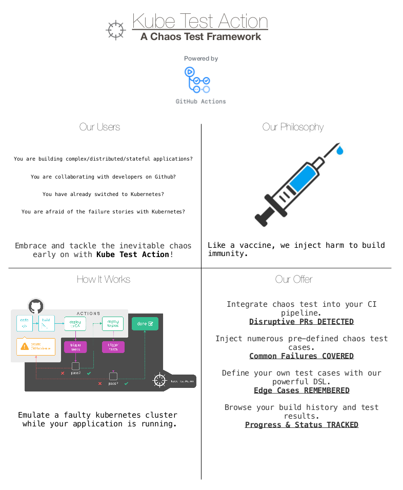

# Kube Test Action

This [GitHub Actions](https://github.com/features/actions) will handle the CI workflow and help run testing experiments on Kubernetes.

## Overview



## QuickStart

To trigger our action service, firstly you should specify our action in your GitHub Workflow:

```yaml
name: CI
on: [push]
jobs:
  test_action:
    runs-on: ubuntu-latest
    steps:
      - name: Checkout
        uses: actions/checkout@master
      # Specify our action
      - name: Kube Test Action
        uses: saintube/Kube-Test@master
```

Then you are able to define your Kube Test workflow in `<repo_root>/.kubetest/ci.yml`:

```yaml
---
- hosts: localhost
  connection: local

  vars_files:
    - ../Kube-Test/env.yml

  vars:
    CHART_PATH: "./charts/"

  environment:
    KUBECONFIG: "{{ kube_config }}"

  tasks:
    - block:

        - name: Test KinD
          shell: >
            kubectl get pods --all-namespaces
          args:
            executable: /bin/bash

        - name: Test
          shell: >
            echo "hello action!"
          args:
            executable: /bin/bash

        - name: Create new ns
          shell: kubectl create ns mysql-operator
          args:
            executable: /bin/bash

        - name: Deploy the app
          include_tasks: ../Kube-Test/funclib/helm_deployer.yaml
          vars:
            action: "deploy"
            chart_path: charts/kubedb

        - name: Experiment - Pod Delete
          include_tasks: ../Kube-Test/experiments/pod-delete.yaml
          vars:
            app_ns: "default"
            app_label: "'app=kubedb'"
            deploy_type: "deployment"
            test_name: "pod-delete"
            c_duration: "15"
            c_interval: "5"
            c_force: "true"
            setup_script: ""
            check_script: ""
            cleanup_script: ""

```
